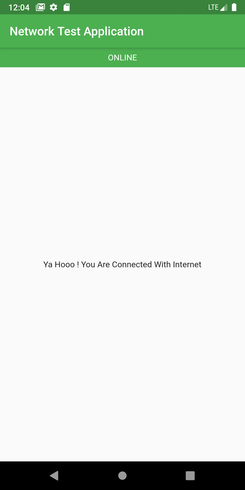
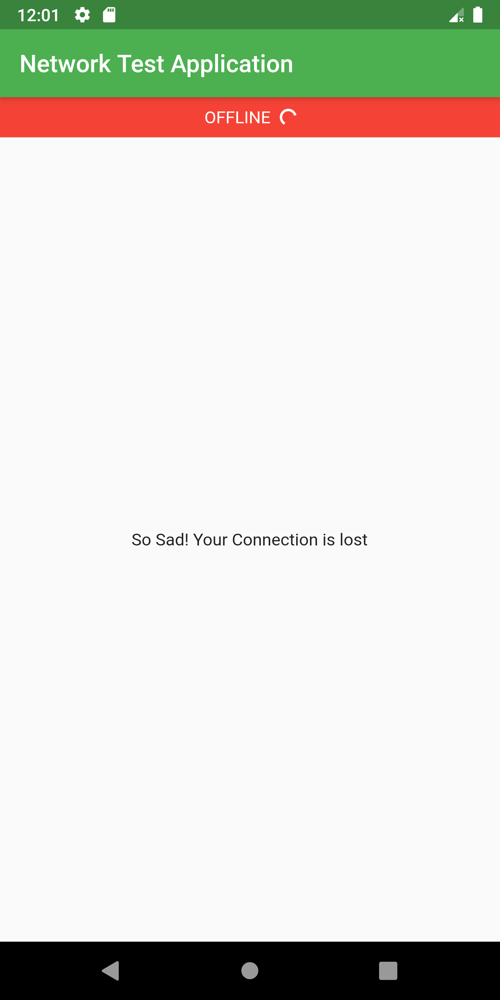

# flutter_connectivity_check_with_provider

Check whether there is an Internet connection available on Flutter app using Provider

 
<table>
  <tr>
    <th>ONLINE</th>
    <th>OFFLINE</th>

  </tr>
  <tr>
    <td></td>
    <td></td>
  </tr>

</table>

 
